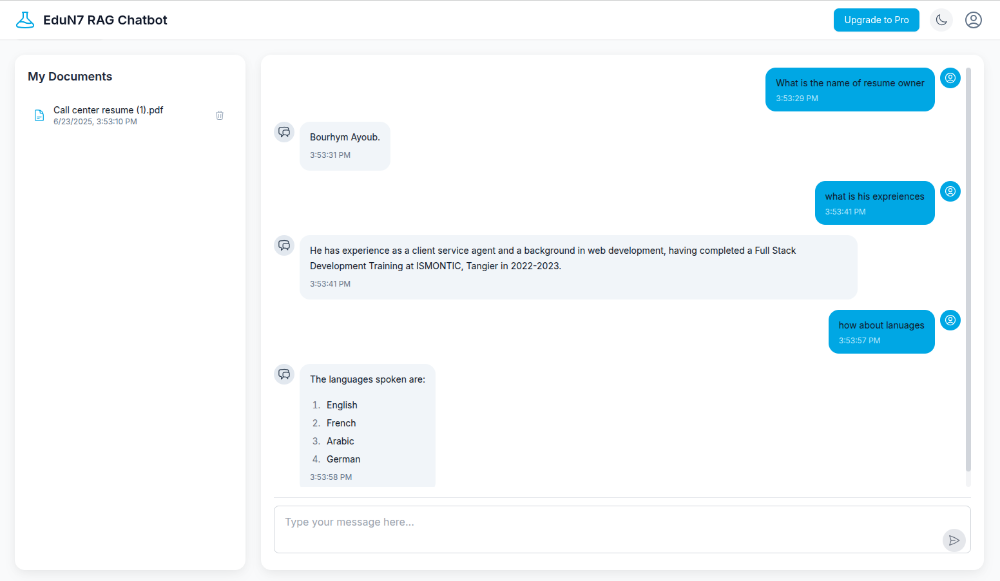

# EduN7 - RAG-Based Chatbot

EduN7 is an advanced Retrieval-Augmented Generation (RAG) chatbot designed to provide precise and contextual responses based on user-provided documents. This application combines modern frontend technologies with a robust backend to deliver an intuitive and powerful document-based question-answering system.



## Features

- **Document Upload and Management**: Easily upload and manage PDF documents
- **Retrieval-Augmented Generation**: Uses Elasticsearch vector database and Groq LLM to provide accurate, contextual responses
- **Modern UI**: Responsive React-based interface with Tailwind CSS styling and dark/light mode
- **Containerized Architecture**: Docker-based deployment for easy setup and scalability
- **RESTful API**: Well-structured Spring Boot backend

## Technology Stack

### Backend
- Java 17
- Spring Boot
- LangChain4j for document processing and embedding generation
- Elasticsearch for vector storage
- Groq API for LLM integration

### Frontend
- React 18
- Tailwind CSS for styling
- Axios for API communication
- React Markdown for rendering formatted responses
- Dark/Light mode support

### Infrastructure
- Docker for containerization
- Docker Compose for multi-container orchestration

## Getting Started

### Prerequisites
- Docker and Docker Compose
- Groq API key (optional - a default key is provided for testing)

### Setup and Installation

1. **Clone the repository**
   ```bash
   git clone https://github.com/yourusername/EduN7_ChatBot.git
   cd EduN7_ChatBot/new-structure
   ```

2. **Set environment variables (optional)**
   ```bash
   export GROQ_API_KEY="your-groq-api-key"
   ```

3. **Build and start the containers**
   ```bash
   docker-compose up -d
   ```

4. **Access the application**
   - Frontend: http://localhost:3002
   - Backend API: http://localhost:8080/api
   - Elasticsearch: http://localhost:9200

## Usage

1. **Upload Documents**: Use the upload area to add PDF documents to the system
2. **Ask Questions**: Type questions in the chat interface or use suggested prompts
3. **Get AI Responses**: Receive contextual answers based on the content of your uploaded documents
4. **Toggle Theme**: Switch between dark and light modes with the theme toggle in the header

## Image Interface

The EduN7 Chatbot features a modern, clean interface with the following components:

1. **Header**: Navigation bar with app title and theme toggle (dark/light mode)
2. **Document Upload**: Card-based interface for uploading PDF documents
3. **Document List**: Grid view of uploaded documents with delete option
4. **Chat Interface**: Modern chat UI with:
   - Message history showing user questions and AI responses
   - Markdown formatting for AI responses
   - Copy-to-clipboard functionality for responses
   - Typing indicator during AI response generation
   - Suggested prompts for common questions
   - Input field with send button

The UI is fully responsive and adapts to different screen sizes, making it accessible on desktop and mobile devices. The dark/light mode themes provide comfortable viewing options for different environments.

## Project Structure

```
├── client/                  # React frontend
│   ├── src/
│   │   ├── components/      # UI components
│   │   ├── contexts/        # Context providers (Theme)
│   │   ├── services/        # API services
│   │   └── App.js           # Main application
│   ├── Dockerfile           # Client Docker configuration
│   └── nginx.conf           # Nginx configuration for serving the app
│
├── server/                  # Spring Boot backend
│   ├── src/
│   │   ├── main/
│   │   │   ├── java/com/edun7/ragchatbot/
│   │   │   │   ├── config/       # Application configuration
│   │   │   │   ├── controller/   # REST controllers
│   │   │   │   ├── model/        # Data models
│   │   │   │   ├── service/      # Business logic
│   │   │   │   └── RagChatbotApplication.java  # Main class
│   │   │   └── resources/        # Application resources
│   ├── Dockerfile                # Server Docker configuration
│   └── pom.xml                   # Maven dependencies
│
└── docker-compose.yml       # Multi-container definition
```

## Contributing

Contributions are welcome! Please feel free to submit a Pull Request.

## License

This project is licensed under the MIT License - see the LICENSE file for details.
